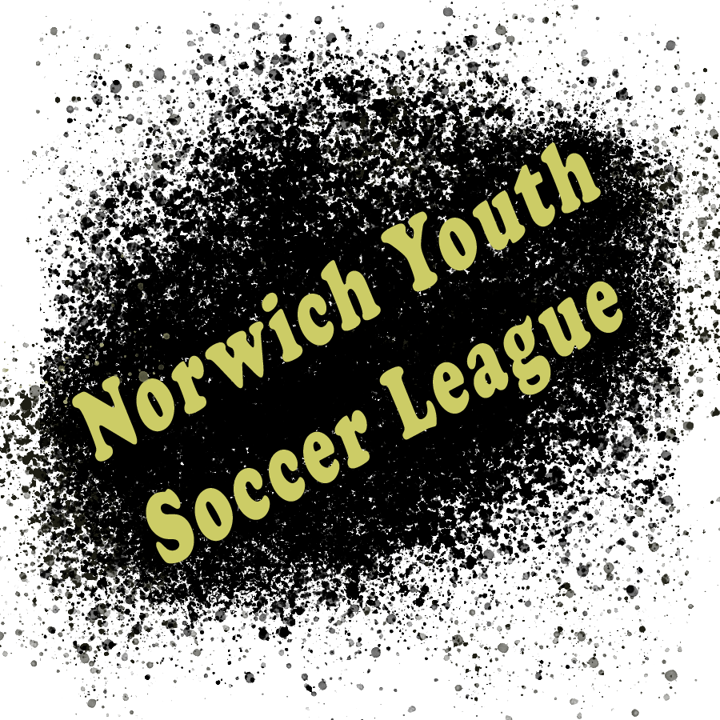

# Norwich Youth Soccer League Website

> A single page website for a fictional youth football team using Vue.js. 
 

## Table of contents
* [General info](#general-info)
* [Technologies](#technologies)
* [Visit the page!](#Click-on-the-link-below-to-check-out-this-project)
* [Features](#features)
* [Status](#status)
* [Contact](#contact)

## General info
The Norwich Youth Soccer League Website is a website made for a fictional football team for young candidates. This project was one of my first adventures to Web Development and to learn HTML, CSS, Javascript, Bootstrap, Vue.js, web design, Firebase, tricks and more. NYSL is my second webpage available online.

## Technologies
* Vue.js
* JavaScript
* jQuery
* HTML
* CSS
* Bootstrap
* Firebase

## Click on the link below to check out this project
<a href="https://nyscwebpage.firebaseapp.com/">https://nyscwebpage.firebaseapp.com/</a>

## Features
* Version 1.0

## Status
Project is: _finished_

## Contact
Created by [@wjulia91](https://www.linkedin.com/in/wjulia91/) - feel free to contact me!
